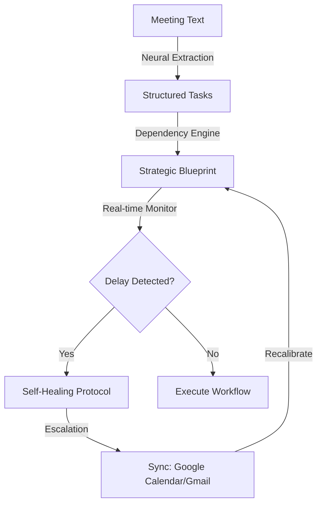

# 🚀 TaskPilot

**The Sovereign Executive Layer for Autonomous Workflow Execution.**

[](https://www.python.org/)
[](https://react.dev/)
[](LICENSE.txt)
[](https://github.com/mahesh-0103)

TaskPilot is an AI-powered command center that transforms raw, unstructured meeting intelligence into a structured, dependency-aware workflow engine. It functions as a digital **Chief of Staff**, utilizing a competitive neural race between multiple LLMs to manifest objectives, assign owners, and project timelines with sub-second latency.

> [!IMPORTANT]
> TaskPilot is intended for research and educational purposes. Ensure you comply with the terms of use for the Google GenAI and Mistral AI APIs when processing sensitive enterprise data.

> [!TIP]
> **WANT TO SEE IT IN ACTION? 🤘**
> Start the backend with `uvicorn main:app` and navigate to `localhost:3000` to access the Sovereign Workspace.

---

### 🏛️ Main Components

- **Synthesis Engine**: Neural manifestation of objectives from raw text using parallel LLM execution.
- **Workflow Architect**: Constructs dependency-aware strategic blueprints from extracted tasks.
- **Telemetry Monitor**: Proactive, real-time tracking of mission-critical deadlines and project status.
- **Self-Healing Loop**: Autonomous recalibration and reassignment of blocked or delayed objectives.
- **Orbital Sync**: Seamless projection of tasks to **Google Calendar** and **Gmail** via secure OAuth protocols.
- **Audit Console**: A complete, traceable decision log of every autonomous action and neural manifestation.

---

### 🔄 System Workflow



---

### 📦 Installation

Install the required dependencies for the backend environment:

```bash
$ cd backend
$ pip install -r requirements.txt
```

Launch the frontend executive layer:

```bash
$ cd frontend
$ npm install
$ npm run dev
```

---

### 🔐 Legal Stuff

TaskPilot is distributed under the Apache Software License. See the `LICENSE.txt` file for more details. 

**AGAIN** - TaskPilot is not affiliated, endorsed, or vetted by Yahoo, Inc. (used for inspiration). It is a standalone, open-source tool. You should refer to the Google API terms of use for details on your rights to use the actual data synchronized.

### P.S.

Please drop [Maheswaran]((https://github.com/mahesh-0103)) a note with any feedback you have. Your feedback drives the evolution of our sovereign intelligence.

---

*TaskPilot • Your Strategic Executive Layer • v1.2.0 • 2026*
