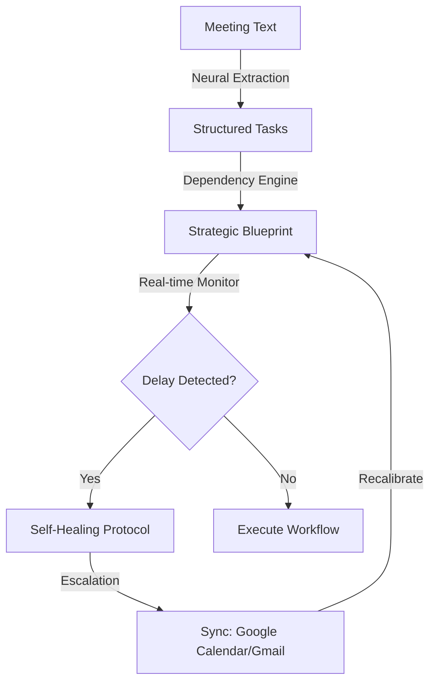

# 🚀 TaskPilot

**The Sovereign Executive Layer for Autonomous Workflow Execution.**

TaskPilot is an AI-powered engine that transforms unstructured meeting data into fully executable, self-healing workflow structures. It functions as a digital Chief of Staff, proactively identifying mission-critical objectives and ensuring project continuity through autonomous neural manifesting.

---

### 🧠 Systems Overview

TaskPilot converts natural language into structured tasks, assigns dependencies, tracks progress, detects bottlenecks, and autonomously takes corrective actions—including **Orbital Synchronization** via Google Calendar and Gmail.

### ⚙️ Specialized Features

*   **⚡ AI Neural Extraction**: High-bandwidth conversion of meeting transcripts into structured objects (Task, Owner, Deadline, Priority, Dependency).
*   **♻️ Self-Healing Engine**: Real-time trajectory monitoring. When a bottleneck is detected, TaskPilot autonomously recalibrates dependencies and reassigns priorities to protect the timeline.
*   **🛰️ Smart Escalation**: Automatic projection of objectives to the cloud. Sends tactical email alerts and creates/updates calendar events for all dependent users.
*   **📜 Decision Trace Logging**: Full transparency. Every autonomous action is recorded with context, reasoning, and a full audit trail.

---

### 🛠️ Technical Architecture

| Component | Technology |
| :--- | :--- |
| **Frontend** | React 18, Vite, Tailwind CSS, Framer Motion |
| **Backend** | FastAPI (Python 3.10+), Pydantic v2 |
| **Persistence** | Supabase (PostgreSQL, Auth, RLS) |
| **Intelligence** | Gemini 1.5 Flash & Mistral Large (Competitive Race Strategy) |
| **Integrations** | Google Calendar API, Gmail API |

---

### 🔄 System Workflow



---

### 🧪 Neural Manifesting Example

**Input:**
> "John will build the API schema by Thursday. After that, Sarah will implement the REST layer. once the layer is ready, Mike will deploy to staging next week."

**Output:**
```json
[
  {
    "task": "Build API schema",
    "owner": "John",
    "deadline": "2026-04-02",
    "depends_on": []
  },
  {
    "task": "Implement REST layer",
    "owner": "Sarah",
    "depends_on": ["task_uuid_1"]
  }
]
```

---

### 🚀 API Strategy

| Path | Purpose |
| :--- | :--- |
| `/extract-tasks` | Neural manifestation of objectives from raw text |
| `/create-workflow` | Strategic sequencing and dependency mapping |
| `/monitor` | Real-time telemetry and delay detection |
| `/self-heal` | Autonomous recalibration of compromised objectives |
| `/execute-tasks` | Final state transition and completion logic |
| `/logs` | Retrieval of the project's audit log |

---

### 🔐 Tactical Setup

#### 1. Backend Core
```bash
cd backend
python -m venv venv
# Windows: .\venv\Scripts\activate
pip install -r requirements.txt
uvicorn main:app --reload
```

#### 2. Frontend Interface
```bash
cd frontend
npm install
npm run dev -- --port 3000
```

#### 3. Environment Calibration
Configure `.env` with `SUPABASE_URL`, `SUPABASE_KEY`, and LLM API credentials.

---

### 🏆 Hackathon Alignment

**Problem Statement:** Agentic AI for Autonomous Enterprise Workflows
**The TaskPilot Solution:**
*   **End-to-End Autonomy**: Zero-human intervention from transcript to execution.
*   **Self-Correcting Architecture**: Workflows that fix themselves without supervision.
*   **Real-time Orbital Sync**: Direct integration into existing enterprise tools (Google Suite).

### 🔮 Future Trajectory
*   **Multi-Agent Orchestration**: Specialized sub-agents for specific domain tasks.
*   **Slack/Teams Integration**: Interactive signal monitoring directly in-chat.
*   **Predictive Telemetry**: Anticipating delays before they occur via historical trends.

---

### 🤝 Strategic Contributors
*   [Maheswaran](https://github.com/mahesh-0103) — **Lead Developer & Architect**

---

*TaskPilot is not just a task manager — it is a self-operating workflow system powered by Intelligence.*
