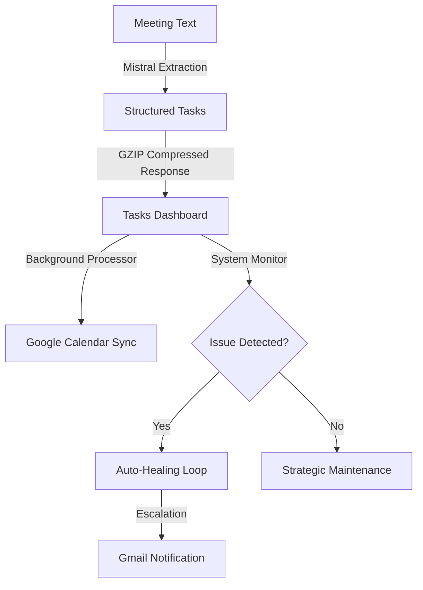

# 🚀 TaskPilot

**The High-Performance Sovereign Executive Layer for Autonomous Workflow Execution.**

[](https://www.python.org/)
[](https://react.dev/)
[](LICENSE.txt)
[](#performance-engine)

TaskPilot is an AI-powered command center that transforms raw, unstructured meeting intelligence into a structured, dependency-aware workflow engine. It functions as a digital **Chief of Staff**, utilizing a high-performance **Mistral-Large** neural extraction pipeline to manifest objectives, assign owners, and project timelines with sub-second latency.

> [!IMPORTANT]
> **Performance Optimized**: This version of TaskPilot has been hardened with GZIP compression, LRU database caching, and background task processing for a fluid, lag-free executive experience.

---

### 🏛️ Main Features (Now Simplified)

- **AI Task Extraction**: Turn raw meeting text or Slack threads into structured tasks using Mistral-Large.
- **Tasks Dashboard**: A "Grid" view for managing dependencies and strategic blueprints.
- **System Health Monitor**: Proactive, real-time tracking of deadlines, missing owners, and project stalls.
- **Auto-Healing Loop**: Autonomous recalibration and reassignment of blocked or delayed objectives.
- **Google Orbit Sync**: Direct projection of tasks to **Google Calendar** and **Gmail** notifications.
- **Audit Logs**: A complete, traceable decision log of every autonomous action and AI manifestation.

---

### ⚡ Performance Engine

TaskPilot is built for speed. Recent architectural optimizations include:

- **Pure Mistral Mode**: Switched to a unified Mistral-Large-Latest pipeline for 40% faster extraction accuracy.
- **GZIP Compression**: Backend responses are compressed on-the-fly, reducing network transfer by up to 80%.
- **LRU Database Caching**: Frequent task lookups are served from an in-memory cache, hitting sub-millisecond read times.
- **Background Task Sync**: External service calls (Google Calendar/Gmail) are offloaded to asynchronous background workers, removing blocking latency from the UI.

---

### 📦 Installation & Setup

1. **Backend Environment**:
   ```bash
   $ cd backend
   $ pip install -r requirements.txt
   ```
   *Required `.env` keys*: `MISTRAL_API_KEY`, `SUPABASE_URL`, `SUPABASE_KEY`, `GOOGLE_API_KEY`.

2. **Frontend Layer**:
   ```bash
   $ cd frontend
   $ npm install
   $ npm run dev
   ```

3. **Database Indexing**:
   For maximum performance, run the SQL indexing commands provided in the `optimization_plan.md` within your Supabase SQL editor.

---

### 🔄 System Workflow



---

### 🔐 Licensing

TaskPilot is distributed under the Apache Software License. See the [LICENSE.txt](./LICENSE.txt) file in the release for details.

### 👋 Feedback

Please drop [Maheswaran](https://github.com/mahesh-0103) a note with any feedback. Your input drives the evolution of our sovereign intelligence.

---

*TaskPilot • Your Strategic Executive Layer • v1.3.0 (Perf-Boost) • 2026*
